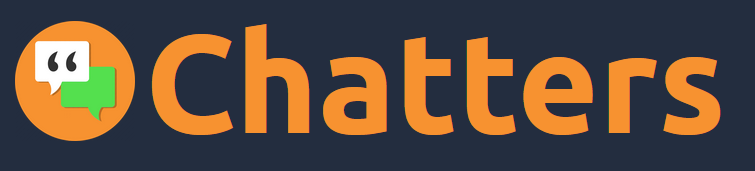

# Chatters - Chat App

Chatters is a chat-social application inspired by Facebook and Messenger. It has a simple and intuitive interface. Create an account. Invite friends, write with them, edit your profile, post on the dashboard.

# Features

## ℹ️ Basic concept

Chatters is primarily intended to provide dynamic conversations with other users. At the same time, allowing them to use other options, such as inviting friends or creating posts.

## 📌 Create an account

Thanks to the use of Firebase, the user can create an account in two ways. Use the classic method of entering your email and password. Or faster - log in directly through your Google account. However, with the first method, he must confirm his account by clicking the activation link in his email.
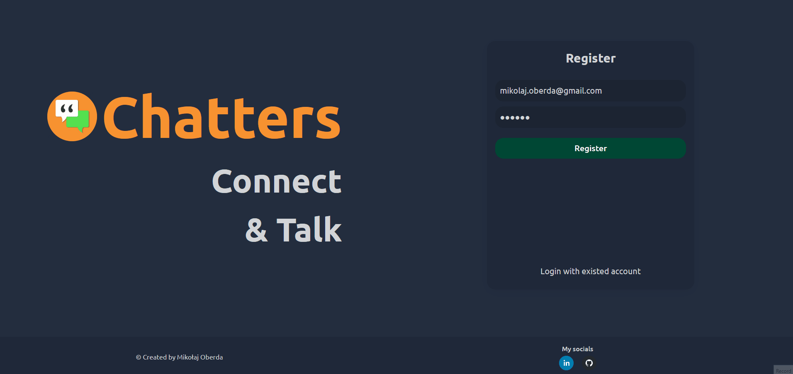
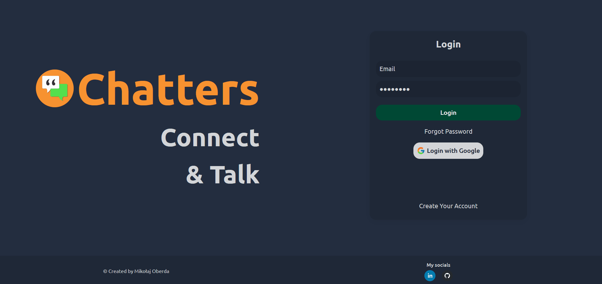

## 🗺️ Dashboard

In the dashboard section, users can insert their posts. At the same time, they can share files and choose from the entire range of gifs that Giphy has to offer

## 🗺️ Profiles

Each user has their own profile. This is where we will find his friends and information about him. Such as personal data, description or social media. We can modify the information. Insert your own avatars or background images. However, you can remove and add friends.
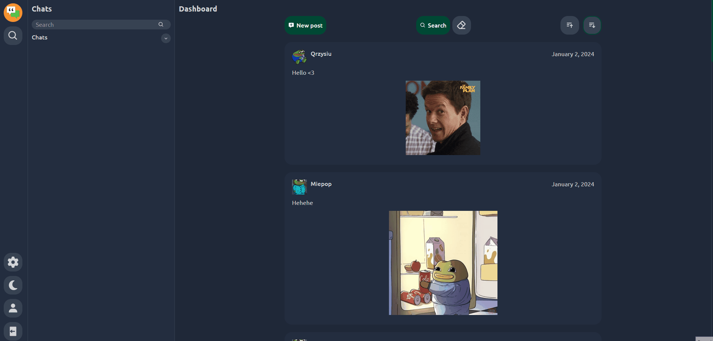
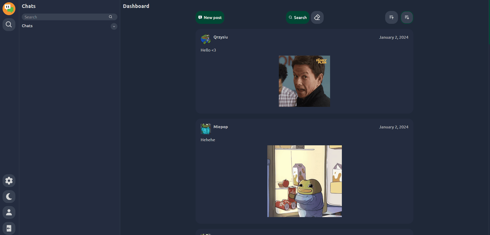

## 💬 Search and send messages

Add to friends, write messages, filter current chats.

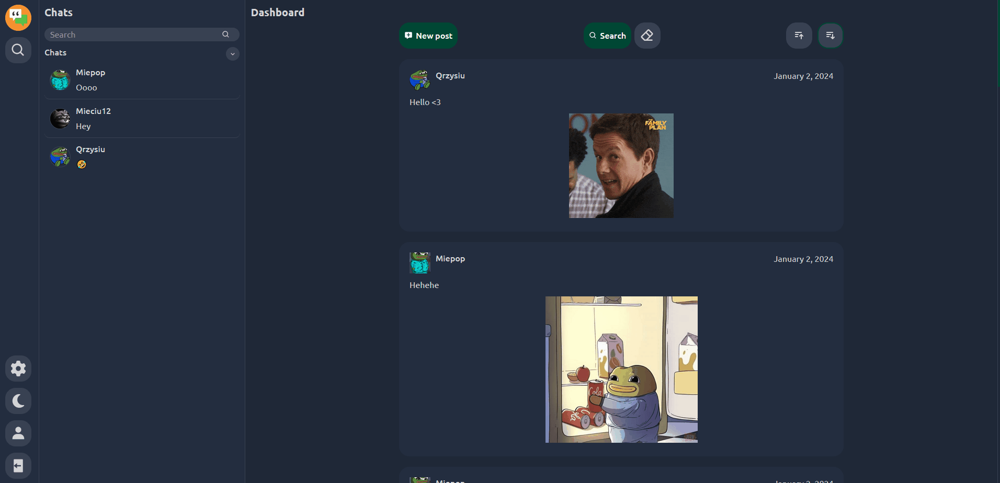

## 🎨 Customize your chat

Choose a theme for your chat, choose one of many emoticons and set it as the basic one. Or delete the chat if you want.

## ☀️🌙 Theme Changer

Using the button, we can change the entire application theme with one click.
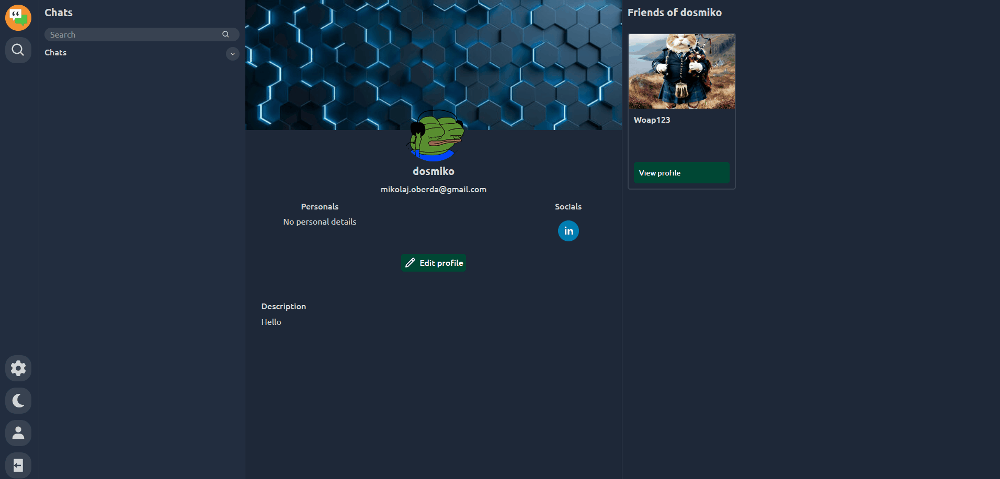

## 📏 Responsiveness

The application is fully responsive and adapts to the current resolution of your screen.
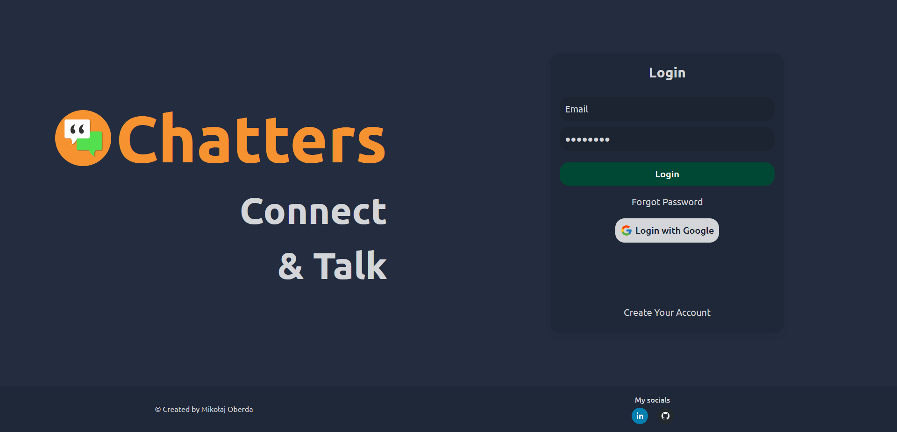
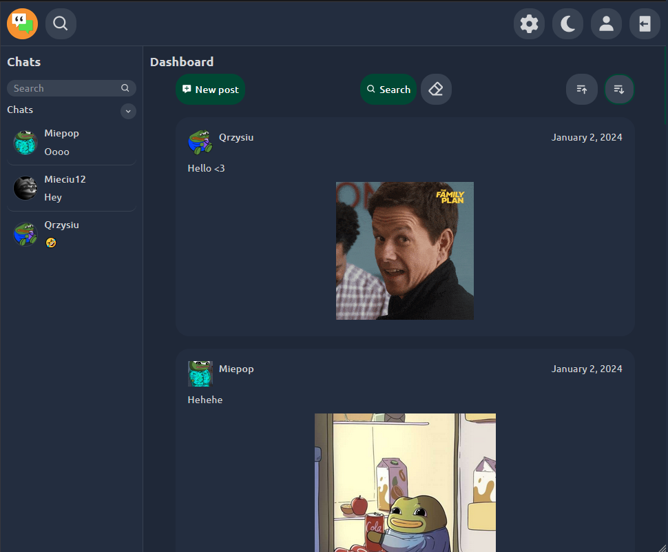
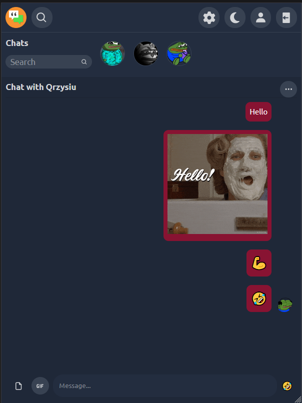

# 🚀 Demo

You can see the application at
https://chatters-mo.netlify.app/

Testing login and password:
Login: cidot77582@vkr1.com
Password: Test1!

# 💻 Tech Stack

- Node v18.14.2
- npm v8.1.0
- Vite
- Vitest
- React Testing Library
- Firebase
- TypeScript
- React
- React Router
- React Query
- React Hook Form
- React Hot Toast
- Styled Components

# 📝 Tests

Current tests coverage (25.01.2024)
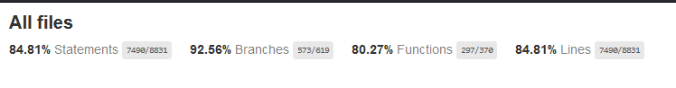

For more info:
[a link](https://github.com/dosmiko7/Chatters/tree/main/documentation/tests/coverage/index.html)

## 👨‍💻 Author

Mikołaj Oberda
[@dosmiko7](https://www.github.com/dosmiko7)
